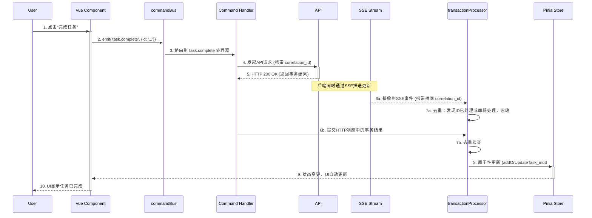

# 前端架构文档："Frontend-as-a-CPU"

## 1. 核心设计哲学

我们的前端架构围绕一个强大的核心思想进行设计：将整个前端应用视为一个 **CPU（中央处理器）**。这种模型为管理应用状态提供了一种高度结构化、可预测且强大的方法，尤其适用于复杂的实时交互环境。

每一个导致数据变更的用户交互，都被视为一条 **“指令”**。这条指令会流经一个定义清晰的流水线，这个流水线精确地映射了现代CPU的经典执行阶段：

1.  **取指 (Instruction Fetch - IF)**: 用户在UI界面上执行一个操作（例如，点击“完成任务”按钮）。
2.  **译码与执行 (Decode & Execute - EX)**: 该操作被翻译成一个具体的命令，并分发到中央的 `CommandBus`（指令总线）。`CommandBus` 找到对应的处理器（Handler）来执行业务逻辑（例如，发起一个API调用）。
3.  **结果 (Result - RES)**: 前端从后端接收到操作结果。这个结果可能是一个直接的HTTP响应，也可能是一个来自SSE (Server-Sent Events) 流的实时事件。
4.  **写回 (Write Back - WB)**: 结果由 `Transaction Processor`（事务处理器）进行处理，该处理器以原子方式更新应用的状态（即我们的“主内存”——Pinia Stores）。

这种方法将UI视图与业务逻辑、状态管理完全解耦，从而构建了一个更易于维护和扩展的代码库。

## 2. 关键设计原则

- **单向数据流**: 数据流严格遵循一个单向、可预测的路径：`组件 -> CommandBus -> API -> Transaction Processor -> Store -> 组件`。这消除了复杂且难以追踪的状态变更。
- **面向指令，而非事件驱动**: 组件不再是分发模糊的“事件”，而是发出明确的 **“指令”**（例如 `task.create`, `schedule.moveItem`）。这使得系统的意图清晰明确，易于理解和追踪。
- **事务性状态更新**: 所有的状态变更都在一个事务（Transaction）内处理。后端返回一个完整的“事务结果”，其中包含主要变更的资源以及所有相关的“副作用”（Side Effects）。前端原子性地应用这些变更，确保前端状态永远保持一致。
- **业务逻辑解耦**: 作为我们“CPU”核心的 `infra`（基础设施）层，完全不感知“任务”或“项目”等任何具体业务概念。它提供了一个通用的、可复用的基础，用于处理指令和管理状态。

---

## 3. "CPU" 核心组件详解

`infra` 目录是整个架构的核心，它包含了实现 "Frontend-as-a-CPU" 模型的所有基础组件。每个组件都与一个CPU硬件概念相对应。

```
src/infra/
├── commandBus/     # 指令总线 (Instruction Bus) + 译码器 (Decoder)
├── transaction/    # 重排序缓冲 (Reorder Buffer) + 提交单元 (Commit Unit)
├── correlation/    # 事务ID生成器 (Transaction ID Generator)
├── events/         # 中断控制器 (Interrupt Controller)
├── logging/        # 调试追踪单元 (Debug Trace Unit)
└── errors/         # 异常处理单元 (Exception Handler)
```

### a. `commandBus` - 指令总线 & 译码器

- **CPU类比**: 指令总线 (Instruction Bus) 和 指令译码器 (Instruction Decoder)。
- **职责**:
  1.  **接收指令**: 作为所有UI组件的统一入口，接收来自用户的操作指令（如 `commandBus.emit('task.complete', { id: '...' })`）。
  2.  **指令译码**: 根据指令的类型（如 `'task.complete'`），查找并匹配到对应的指令处理器 (`Handler`)。
  3.  **分发执行**: 将指令的载荷 (`payload`) 传递给该处理器去执行。
- **重要性**: `commandBus` 解耦了“指令的发出者”（UI组件）和“指令的执行者”（业务逻辑处理器），使得UI层无需关心业务逻辑的具体实现。

### b. `transactionProcessor` - 重排序缓冲 & 提交单元

- **CPU类比**: 重排序缓冲 (Reorder Buffer) 和 提交单元 (Commit Unit)。这是确保数据一致性的关键。
- **职责**:
  1.  **统一处理结果**: 无论是API的HTTP响应还是SSE推送的实时事件，都会被送入 `transactionProcessor`。
  2.  **指令去重 (Deduplication)**: 在乱序执行的环境下，同一个操作的结果可能会通过HTTP和SSE两种渠道到达。`transactionProcessor` 使用 `correlation_id` 来识别并丢弃重复的事务，确保每个操作只被应用一次。
  3.  **原子性写回 (Atomic Write-Back)**: 它接收一个包含“主资源”和“副作用”的完整事务包，然后一次性地、原子地将所有变更应用到对应的Pinia Store中。这保证了UI状态的最终一致性。

### c. `correlation` - 事务ID生成器

- **CPU类比**: 事务ID生成器 (Transaction ID Generator)。
- **职责**:
  1.  **生成唯一ID**: 在指令发出时（即API请求发起前），生成一个唯一的 `correlation_id`。
  2.  **追踪事务**: 这个ID会随着API请求发送到后端，并且后端会在处理完成后，将其包含在HTTP响应和SSE事件中一并返回。
  3.  **关联请求与响应**: `transactionProcessor` 正是利用这个ID来关联原始请求和最终结果，实现精准的去重和追踪。

### d. `events` - 中断控制器

- **CPU类比**: 中断控制器 (Interrupt Controller)。
- **职责**:
  1.  **管理SSE连接**: 负责建立和维护与后端的Server-Sent Events (SSE) 连接。
  2.  **事件分发**: 监听来自服务器的实时事件，并将其转发给 `transactionProcessor` 进行处理。这类似于CPU接收到一个外部硬件中断。
  3.  **自动重连**: 在连接断开时，能够自动尝试重新连接，保证实时数据通道的稳定性。

### e. `logging` - 调试追踪单元

- **CPU类比**: 调试追踪单元 (Debug Trace Unit)，例如Intel的Processor Trace。
- **职责**:
  1.  **结构化日志**: 提供统一的、结构化的日志记录功能。
  2.  **指令流水线追踪**: 其核心是 `InstructionTracker`，它可以追踪单条指令从 `IF -> EX -> RES -> WB` 的完整生命周期，并记录每个阶段的耗时和元数据。这对于调试性能问题和理解复杂的执行流至关重要。

### f. `errors` - 异常处理单元

- **CPU类比**: 异常处理单元 (Exception Handler)。
- **职责**:
  1.  **全局错误捕获**: 统一捕获应用中所有未被处理的异常，包括Vue组件错误、异步代码错误等。
  2.  **错误上报**: 将捕获到的错误信息格式化并上报到监控服务，以便进行分析和告警。

## 4. 指令执行流程图 (Data Flow)

下面这张图详细展示了当用户执行一个操作（例如“完成任务”）时，一条指令从发起到最终状态更新的完整生命周期。



**流程说明:**

1.  **用户操作**: 用户与界面交互。
2.  **指令发射**: Vue组件将用户操作转换为一个明确的指令，并发送到 `commandBus`。
3.  **指令路由**: `commandBus` 根据指令名称，将其分发给对应的 `Handler`。
4.  **API调用**: `Handler` 执行业务逻辑，通常是调用后端API。此时会生成一个 `correlation_id` 并随请求发送。
5.  **HTTP响应**: API成功执行后，返回一个包含“主资源”和“副作用”的事务结果。
6.  **结果并发到达**:
    - `6a`: 后端可能会通过SSE通道实时推送更新，这个更新也会被 `transactionProcessor` 接收。
    - `6b`: 与此同时，API的HTTP响应也被 `Handler` 提交给 `transactionProcessor`。
7.  **事务去重**: `transactionProcessor` 的核心价值体现于此。它通过检查 `correlation_id`，确保无论是SSE事件还是HTTP响应，同一个事务只会被处理一次，避免了重复更新状态导致的问题。
8.  **原子写回**: `transactionProcessor` 将事务结果中的所有变更（主资源和副作用）一次性应用到Pinia Store中。
9.  **UI更新**: Pinia Store的状态变更被Vue的响应式系统捕获，自动更新相关的UI组件。
10. **反馈用户**: 用户在界面上看到操作成功的最终结果。

## 5. 实践指南：在组件中使用 `commandBus`

理论结合实践，以下是一个在Vue组件中如何使用 `commandBus` 来更新任务标题的实例。

### 场景

在一个任务卡片组件 (`KanbanTaskCard.vue`) 中，用户修改了任务标题，我们需要将这个变更持久化。

### 错误的做法 ❌

直接在组件中调用API和Store。

```vue
<script setup>
import { ref } from 'vue'
import { api } from '@/api' // 直接依赖 api
import { useTaskStore } from '@/stores/task' // 直接依赖 store

const props = defineProps({ task: Object })
const taskStore = useTaskStore()

async function updateTitle(newTitle) {
  try {
    // 1. 直接调用 API
    const updatedTask = await api.patch(`/tasks/${props.task.id}`, { title: newTitle })
    // 2. 直接操作 Store
    taskStore.addOrUpdateTask_mut(updatedTask)
  } catch (error) {
    // 3. 需要在组件中处理错误
    console.error('Failed to update task:', error)
  }
}
</script>
```

**问题**:

- **紧密耦合**: 组件与API实现、Store的mutation方法紧密耦合。
- **逻辑重复**: 如果其他地方也需要更新任务，这套 `api -> store -> error handling` 的逻辑需要被复制。
- **违反单向数据流**: 数据流变得混乱，组件既调用API又直接修改Store。

### 正确的做法 ✅

通过 `commandBus` 发射指令。

```vue
// KanbanTaskCard.vue
<script setup>
import { commandBus } from '@/commandBus'

const props = defineProps({ task: Object })

async function updateTitle(newTitle) {
  // 只需发射一条意图清晰的指令
  // 组件不关心这条指令如何被执行，由哪个handler处理
  await commandBus.emit('task.update', {
    id: props.task.id,
    data: { title: newTitle },
  })
  // 无需 try/catch，全局错误处理器会捕获异常
}
</script>
```

**优势**:

- **完全解耦**: 组件只负责表达“做什么”（`task.update`），而不关心“怎么做”。
- **逻辑集中**: 更新任务的完整逻辑（API调用、`transactionProcessor`处理、Store更新）被封装在 `taskHandlers.ts` 中，可被任何组件复用。
- **代码简洁**: 组件代码变得极其简洁和清晰，只关注UI和用户交互。
- **易于测试**: 我们可以轻易地 mock `commandBus.emit` 方法来测试组件，或者独立测试 `task.update` 的 `Handler`。
